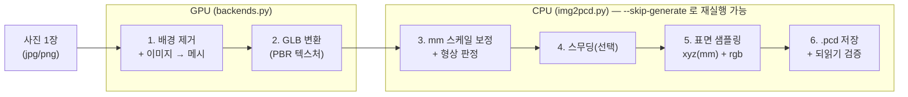

# trellis2-img2pcd

이미 생성된 `mesh.glb`에 사진의 색상·질감을 입히려면 [기존 메시 텍스처 생성 안내](TEXTURE.md)를 참고하세요.
`texture_existing.py`는 형상을 다시 생성하지 않고 OBJ/MTL/PBR 텍스처와 GLB를 만듭니다.

**자동차 부품 사진 1장 → 3D → mm 스케일 점군(`.pcd`)** 이 실제로 되는지 검증한 스파이크.

합성 결함 데이터 PoC(`bumper-synth`)가 부품 3D 에셋을 필요로 하는데, 그걸 **3D 스캐너 대신
사진 한 장 + 생성 모델**로 만들 수 있는지 확인하는 것이 목적이었다.
부품에 종속된 설정은 `parts.yaml` 하나뿐이라 다른 물체에도 그대로 쓸 수 있다.

---

## 결론 (2026-09-08)

> **파이프라인은 관통했다. 그러나 생성된 에셋은 계측용으로 쓸 수 없다.**
> 결함 깊이 **0.1~1mm** 를 다뤄야 하는데, 부품 **깊이 자체가 최대 7배** 틀린다.

| 확인한 것 | 결과 |
|---|---|
| 이미지 → 3D → mm PCD 전 구간 | ✅ 동작 (Hunyuan3D-2.1 백엔드) |
| 소요 시간 | 33.5 s / 부품 |
| VRAM 피크 | 7.63 GiB (RTX 4090 24GB 여유) |
| 산출 | 300,000 points · 4.58 MB · 되읽기 검증 통과 |
| **형상 정확도** | ❌ **부풀림(pillow inflation)** — 아래 표 |

### 판정 근거 — 실측 bbox 대조

| 부품 | 실제 (mm) | 생성 결과 (mm) | 최소축 배율 | 판정 |
|---|---|---|---|---|
| 범퍼 커버 | 1750 × 450 × 350 | 1750 × **963** × **516** | **×1.47** | FAIL |
| 본네트 | 1500 × 1300 × 200 | 1490 × 1240 × **1500** | **×6.2** | FAIL |

- 본네트는 **최장축이 깊이로 잡혔다** — 판때기가 거의 정육면체가 됐다는 뜻이다.
  표면적도 16.2 m²(실제 양면 합쳐 ~4 m²)로 4배.
- 본네트가 범퍼보다 **해상도 4배**(1299×1023 vs 600×342)인데 결과는 **더 나빴다**.
  → 입력 품질 문제가 아니라 **방법의 한계**다.

**원인**: 단일 뷰 image-to-3D 는 보이지 않는 뒷면을 지어내야 하는데, 학습 데이터가 대체로
"부피 있는 물체"라 **얇은 판을 얇게 유지하지 못한다**. 정면 직교 사진은 깊이 단서가 가장
적은 각도라 특히 불리하다.

**의미**: 상위 spec 이 원본 데이터를 **3D 카메라 점군**으로 잡은 판단이 옳았다는 것을,
추측이 아니라 실측으로 뒷받침한다. 생성 모델은 스캐너의 대체재가 아니라 잘해야 형상 다양성 보조.

---

## 어떻게 판정하는가

생성 메시는 단위 박스 `[-0.5, 0.5]` 로 정규화되어 나오므로 **크기 정보가 없다**.
`parts.yaml` 에 사람이 넣은 실측 치수(`target_mm`)로 최장축을 맞춘 뒤,
**3축 실측치(`expect_mm`)와 내림차순으로 대조**해 축별 배율을 찍는다.

```yaml
- name: bumper_cover
  image: inputs/bumper.jpg
  target_mm: 1750           # 최장축을 여기에 맞춘다
  expect_mm: [1750, 450, 350]   # 3축 실측 -> 형상 판정 기준
```

최장축은 스케일 보정 때문에 **항상 1.00** 이 나온다. 따라서 실제 판정선은 **최소축 배율**,
즉 깊이가 얼마나 부풀었는가다. 실행이 끝나면 이렇게 나온다:

```
bumper_cover  300,000 pts  bbox_mm=[1750.0, 963.2, 516.4]  4.58MB  형상 FAIL (최소축 x1.47)
```

축 순서를 맞추지 않고 양쪽을 정렬해 비교하는 이유는, 생성 메시의 방향이 제멋대로라
x/y/z 를 그대로 짝지으면 의미가 없기 때문이다. 눈대중 대조를 숫자로 옮긴 부분이다.

---

## 파이프라인



**설계 포인트 — 백엔드 경계**: GPU 를 쓰는 1~2단계만 `backends.py` 에 격리했다.
3~6단계는 GLB 하나만 받으므로 **모델을 갈아끼워도 그대로 돌고**, 두 모델의 결과를
같은 뒷단으로 비교할 수 있다. 이번 판정도 이 구조 덕분에 가능했다.

| 백엔드 | 모델 | 상태 |
|---|---|---|
| `hunyuan3d` | `tencent/Hunyuan3D-2.1` | ✅ 실행 검증됨 (위 실측치) · gated 의존성 없음 |
| `trellis2` | `microsoft/TRELLIS.2-4B` | ⚠️ 미검증 — **다음 과제**. 코드·환경 점검 완료 |

### 산출물

```
out/<부품>/
  mesh.glb          생성 원본 (단위 박스, PBR 텍스처)
  mesh_mm.ply       mm 스케일 메시
  <부품>.pcd        ★ xyz(mm) + rgb
  preview.png       XY/XZ/YZ 3면도 (헤드리스에서도 생성)
  manifest.json     이미지·seed·스케일 배율·bbox·형상 판정·소요시간·VRAM 피크
out/run.json        전체 요약
```

---

## 실행

```bash
git clone https://github.com/biop99999111/trellis2-img2pcd.git
cd trellis2-img2pcd
export HF_TOKEN=hf_...            # PowerShell: $env:HF_TOKEN="hf_..."

python check_env.py --hf          # 0. HF 모델 4곳 접근 확인 (GPU 불필요 · 30초)
python check_env.py               # 1. 실행 환경 진단 — FAIL 0 확인
bash setup_vast.sh                # 2. 설치 + 가중치 16.4 GiB (20~40분)

conda activate trellis2
python img2pcd.py --backend trellis2  --out out_trellis
python img2pcd.py --backend hunyuan3d --out out_hy       # 비교 기준
```

`setup_vast.sh` 는 **시작 직후** 접근 검사를 한다. 확장 빌드 30분을 태운 뒤에
gated 401 을 만나면 빌린 GPU 시간이 그대로 날아가기 때문이다.

노트북으로 하려면 `run_spike.ipynb` 를 열고 커널을 **Python (trellis2)** 로 바꾼다.

### 자주 쓰는 옵션

| 플래그 | 뜻 |
|---|---|
| `--only hood` | 부품 하나만 |
| `--skip-generate` | GPU 없이 기존 GLB 에서 3~6단계만 (몇 초) |
| `--points 500000` / `--spacing-mm 0.8` | 점 개수 / 점 간격 기준 자동 산출 |
| `--smooth 8` | Taubin 스무딩 (부피가 줄지 않는 방식) |
| `--single-view` | hidden point removal — 3D 카메라 1시점처럼 앞면만 |
| `--pipeline-type 512` | trellis2 생성 해상도 (`512`\|`1024`\|`1024_cascade`\|`1536_cascade`) |
| `--rembg ZhengPeng7/BiRefNet` | 배경 제거 모델 교체 (gated 회피용) |
| `--seed 42` | 재현성 |

---

## 환경 요구사항

| 항목 | 필요 | 비고 |
|---|---|---|
| OS | **Linux** | 공식적으로 Linux 전용 |
| GPU | NVIDIA **24GB+** | ✅ RTX 4090 검증됨 · ❌ **5090 금지**(sm_120 ↔ cu124 핀 충돌) |
| **CUDA toolkit (`nvcc`)** | **필수** | ⚠️ **`*-devel` 이미지 또는 PyTorch 템플릿**. `*-runtime` 은 소스 빌드 실패 |
| conda / gcc | 필수 | 확장 4종이 소스 빌드 |
| 디스크 | 100GB+ | 가중치 16.4GB + 의존성 30GB |
| PyTorch | 미리 깔 필요 없음 | `setup.sh` 가 conda env `trellis2` 에 `torch==2.6.0`(cu124) 설치 |

### HuggingFace 모델 (4곳 · gated 2곳)

`pipeline.json` 에 박혀 있어 코드로 우회할 수 없다. 하나라도 막히면 로드가 401 로 죽는다.

| 레포 | 크기 | gated | 용도 |
|---|---|---|---|
| `microsoft/TRELLIS.2-4B` | 14.3 GiB | — | 본체 가중치 8종 |
| `microsoft/TRELLIS-image-large` | 0.14 GiB | — | `pipeline.json` 이 참조하는 **v1** decoder |
| [`facebook/dinov3-vitl16-pretrain-lvd1689m`](https://huggingface.co/facebook/dinov3-vitl16-pretrain-lvd1689m) | 1.13 GiB | **manual** | 이미지 인코더. Meta 수동 승인 — 대기 시간 있음 |
| [`briaai/RMBG-2.0`](https://huggingface.co/briaai/RMBG-2.0) | 0.82 GiB | **auto** | 배경 제거. 약관 동의 즉시 통과. **비상업 라이선스** |

1. 위 두 gated 페이지에서 각각 **약관 동의**
2. https://huggingface.co/settings/tokens 에서 **read 토큰** 발급
   - ⚠️ fine-grained 토큰이면 **"Read access to contents of all public gated repos you can access"**
     체크 필수. 안 그러면 승인을 받아도 계속 403 이 난다. **Classic → Read** 가 확실하다.
3. `export HF_TOKEN=hf_...` → `python check_env.py --hf` 로 4곳 전부 OK 확인

`RMBG-2.0` 은 배경 제거에만 쓰이므로, 승인이 없거나 상업 사용이 걸리면 구조가 같은
MIT 모델로 교체할 수 있다 — `--rembg ZhengPeng7/BiRefNet`.

---

## 검증 상태

| 대상 | 방법 | 결과 |
|---|---|---|
| CPU 단계(3~6) | `python smoke_test.py` — 합성 메시로 스케일 정확도(±1%)·seed 재현성·PCD 되읽기·형상 판정 | ✅ **12/12** |
| transformers 호환 패치 | `python test_compat.py` — 4.x/5.x 두 레이아웃의 DINOv3 특징이 동일한지 (GPU·가중치 불필요) | ✅ **10/10** (max diff 0) |
| GPU 단계 — Hunyuan3D | vast.ai RTX 4090 실행 | ✅ 관통 (형상 품질은 FAIL) |
| GPU 단계 — TRELLIS.2 | — | ⚠️ **미검증 (다음 과제)** |

---

## 알려진 함정

실제로 부딪혀 해결한 것들이다. 전부 스크립트에 반영돼 있어 **다시 만나지 않는다**.

<details>
<summary><b>설치 · 환경 (6건)</b></summary>

| 증상 | 원인 | 조치 |
|---|---|---|
| `ModuleNotFoundError: trellis2` | pip 패키지가 아니라 레포 소스 트리 | 자동 탐색 후 `sys.path` 추가 |
| DINOv3 401 → 403 | `gated: manual` (Meta 수동 승인) | 승인 + Classic Read 토큰 |
| pip 무한 정지 | basicsr 빌드 격리가 torch 재다운로드(~2.5GB) | `--no-build-isolation` + cython 선설치 |
| 1.1 MB/s 스로틀 (회선은 169 MB/s) | `requirements.txt` 안의 중국 미러 `--extra-index-url` | 해당 줄 제외 |
| requirements 전체 실패 | `bpy==4.0` 이 PyPI 에서 삭제됨 | 제외 (shape 경로엔 불필요) |
| `conda activate` 실패 | 비대화형 서브셸 | `profile.d/conda.sh` 훅 선로드 |

⚠️ 설치 **도중에** pip 인덱스를 바꾸지 말 것. 캐시 키가 URL 기준이라 무효화되어 받은 걸 다시 받는다.
</details>

<details>
<summary><b>런타임 · 상류 이슈 (4건)</b></summary>

- **transformers 5.x** — 공식 `setup.sh` 가 transformers 를 **핀 없이** 깔아서 오늘 설치하면 5.x 가
  들어온다. 5.x 는 `DINOv3ViTModel` 의 블록을 encoder 하위로 옮겨서 원본 코드가
  `AttributeError: 'DINOv3ViTModel' object has no attribute 'layer'` 로 죽는다
  ([#147](https://github.com/microsoft/TRELLIS.2/issues/147) · PR [#148](https://github.com/microsoft/TRELLIS.2/pull/148)/[#156](https://github.com/microsoft/TRELLIS.2/pull/156), 셋 다 미머지).
  → `requirements.txt` 가 `<5` 로 되돌리고, `backends.py` 가 양쪽 레이아웃을 모두 탄다.
  `model.forward()` 로 우회하지 **않는다** — 그 경로는 학습된 affine(`self.norm`)을 태워
  조건 특징이 달라지고, 그러면 모델 비교 실험 자체가 오염된다.
- **VRAM** — 24GB 급에서 1024³/1536³ 메시 후처리가 OOM 으로 보고돼 있다
  ([#188](https://github.com/microsoft/TRELLIS.2/issues/188)). 중간 텐서 21GB 잔류가 원인이라
  `del` + `empty_cache` + `expandable_segments:True` 를 걸었고, 그래도 터지면 `512` 로
  **한 번 자동 재시도**한다(빌린 세션을 통째로 날리지 않기 위해).
- **CuMesh 빌드 실패** — CUDA 가 여러 개면 `CUDA_HOME` 필요([#106](https://github.com/microsoft/TRELLIS.2/issues/106)). `setup_vast.sh` 가 `/usr/local/cuda` 로 지정.
- **env 격리** — TRELLIS.2 와 Hunyuan3D 는 각자 conda env 를 쓴다. 오가는 것은 파일(GLB/PCD)뿐이다.
</details>

<details>
<summary><b>데이터 · 해석 (5건)</b></summary>

- **mm 스케일은 자동이 안 된다** — 생성 메시는 단위 박스로 정규화되어 나온다.
  `target_mm` 은 **사람이 넣는 실측값**이고, 틀리면 뒤가 전부 틀린다.
- **`fit_axis: auto` 는 최장축을 고른다** — 형상이 틀리면 엉뚱한 축을 고른다(본네트가 실제로 그랬다).
  **형상 검증 없이 스케일 숫자만 믿으면 안 된다.**
- **표면 울렁임** — 생성 메시는 sub-mm 에서 매끄럽지 않다. 결함 깊이(0.1~1mm)와 배경 노이즈가
  겹치는지 확인해야 한다.
- **앞뒤 사진은 합쳐지지 않는다** — 같은 부품의 외판·내판을 각각 넣으면 하나로 합쳐진 3D 가
  아니라 별개 오브젝트 두 개가 나온다.
- **`--single-view` 는 닫힌 메시에서만 의미** — 열린 판때기면 다 보이므로 점이 안 줄어든다.
</details>

---

## 다음 과제

1. **TRELLIS.2 로 같은 사진 재현** — 미검증 백엔드. 깊이가 300mm 대로 나오면 모델 차이가
   실재하는 것이고, 비슷하게 부풀면 방법의 한계가 확정된다.
2. **3/4 측면 뷰 사진으로 재시도** — 모델 교체보다 이쪽이 효과가 클 가능성이 높다.
   정면 직교가 깊이 단서 최소 각도이므로.
3. (선택) **SPAR3D 백엔드 추가** — 중간 산출이 점군이라 궁합이 좋고, 생성 점군을 사람이 직접
   편집할 수 있다. 7GB / 0.7초로 비용이 거의 없다.

재개 절차·실측 로그·미결 사항은 **[`HANDOFF.md`](HANDOFF.md)** 에 있다.

---

## 파일 구성

| 파일 | 역할 |
|---|---|
| `img2pcd.py` | 오케스트레이션 + CPU 3~6단계 (스케일·형상 판정·스무딩·샘플링·PCD·검증·미리보기) |
| `backends.py` | GPU 1~2단계. `Trellis2Backend` / `Hunyuan3DBackend` |
| `parts.yaml` | 부품 정의(`target_mm`·`expect_mm`) + 공통 설정 |
| `check_env.py` | 설치 전 진단 (stdlib 만). nvcc·VRAM·디스크·conda·HF 접근 4곳 |
| `prefetch_models.py` | 가중치 16.4GiB 선다운로드 (`--dry-run` 이면 접근 확인만) |
| `smoke_test.py` | GPU 없이 CPU 단계 검증 |
| `test_compat.py` | transformers 4.x/5.x 호환 패치 검증 |
| `setup_vast.sh` / `setup_hunyuan3d.sh` | 설치 자동화 |
| `run_spike.ipynb` | Jupyter 9섹션 (진단 → 설치 → 생성 → 검증표) |

## 라이선스

이 레포의 코드는 자유롭게 쓰되, TRELLIS.2 · Hunyuan3D 본체와 그 의존성(특히 비상업
라이선스인 `briaai/RMBG-2.0`)의 라이선스는 각 프로젝트를 따른다.
